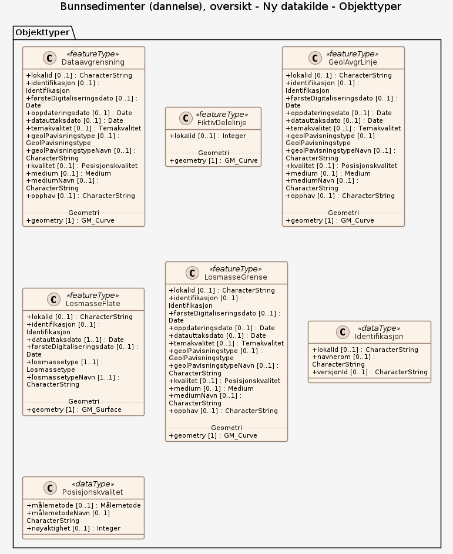

# Produktspesifikasjon: Bunnsedimenter (dannelse), oversikt

*Datasettet viser bunnsedimenter i havbunnens øvre del (1-2 m under sjøbunnen), klassifisert etter jordartstype. Jordart som egenskap beskriver løsmassenens dannelsesmåte. Dataene dekker deler av Norsk kontinentalsokkel i Norskehavet, Nordsjøen og i Skagerrak. Datagrunnlaget for dette tema er innholdet i kvartærgeologiske kart (løsmassekart) som foreligger analogt, og/eller digitale data fra moderne kartlegging. Dataene er digitalisert med tanke på presentasjon i målestokk =<1:1 000 000 (oversiktskart).*

**Nøkkelord:** avsetning, sediment, bart fjell, bunntyper, ekkolodd, geologi, habitat, hav, havbunn, løsmasser, marin, maringeologi, multistråleekkolodd, overflatesediment, sand, silt, slam, stein, undervanns, sjøbunn, kartlegging, natur, naturtype, prosesser, jordart, kvartærgeologi, kvartære sedimenter, glasimarin, morene, bunnstrøm, skredavsetning, løsmasseskred, suspensjonsavsetning, Norge, norsk kontinentalsokkel, Norskehavet, Skagerrak, Nordsjøen, Havområder, Inspire, Norge digitalt, geodataloven, Mareano, fellesDatakatalog, NGU

**Emnekategorier:** Geovitenskapelig informasjon

**Geografisk utstrekning**:

- **Vest**: 2.0
- **Øst**: 33.0
- **Sør**: 57.0
- **Nord**: 72.0

**Tidsmessig utstrekning**:

- **Tidsperiode**:
  - **Fra**: 2022-05-19
  - **Til**: 2022-05-19

## Om spesifikasjonen

> **Denne versjonen av produktspesifikasjonen:**  
> **Opprettet dato:**  
> **Endret dato:** 2022-05-19 
> **Språk:** nor 
> **Kontaktinformasjon:** Norges geologiske undersøkelse, [valerie.bellec@ngu.no](mailto:valerie.bellec@ngu.no)

## Om produktet Bunnsedimenter (dannelse), oversikt

> **Romlig representasjonstype:** Vektor 
> **Unik identifikator:** <https://data.geonorge.no/sosi/geologi/bunnsediment_dannelse_oversikt> 
> **Kontaktinformasjon:** Norges geologiske undersøkelse, [valerie.bellec@ngu.no](mailto:valerie.bellec@ngu.no)
>
> **Romlig oppløsning:**
>
> **Ekvivalent målestokk**: 1000000
>
> **Begrensninger:**
>
> **Ressursbegrensninger**:
>
> - **Bruksbegrensninger**: Detaljnivået på datasettet tilsier bruk innenfor kartmålestokken: 1:250.000 - 1:1.000.000
>
> **Juridiske begrensninger**:
>
> - **Tilgangsbegrensninger**: Åpne data
> - **Bruksbegrensninger**: Lisens
> - **Lisens**: Norsk lisens for offentlige data (NLOD)
> - **Lisenslenke**: <http://data.norge.no/nlod/no/1.0>
>
> **Sikkerhetsbegrensninger**:
>
> - **Klassifisering**: Ugradert

### Formål

Kunnskap om løsmassene er nødvendig for å forstå prosesser i det marine miljøet, og kunnskap om fordeling av løsmasser er viktig for en best mulig forvaltning av havområder og ressurser.

### Bruksområde

Datasettet kan anvendes som underlag i overordnet areal- og miljøplanlegging. Datasettet kan også benyttes som underlag i forbindelse med planlegging av undersøkelser innen f.eks. sårbarhetsanalyse, habitatskartlegging osv.

## Omfang

### Hele datasettet

**Nivå**: dataset

**Nivåbeskrivelse**: Gjelder hele datasettet. Hvis omfang ikke er oppgitt under en overskrift, gjelder teksten for hele datasettet og alle leveranser

### Ny datakilde

**Nivå**: dataset

## Datainnhold og struktur

### Datamodell - Ny datakilde

➡️ [Se full datamodell for omfang "Ny datakilde" (diagram per pakke og objektkatalog)](ny-datakilde/objektkatalog.html)

## Referansesystem

| EPSG-kode | Navn på referansesystem |
| --- | --- |
| [EPSG:25832](https://epsg.io/25832) | [EUREF89 UTM sone 32, 2d](https://register.geonorge.no/epsg-koder) |
| [EPSG:25833](https://epsg.io/25833) | [EUREF89 UTM sone 33, 2d](https://register.geonorge.no/epsg-koder) |
| [EPSG:25835](https://epsg.io/25835) | [EUREF89 UTM sone 35, 2d](https://register.geonorge.no/epsg-koder) |
| [EPSG:32632](https://epsg.io/32632) | [WGS84 UTM sone 32, 2d](https://register.geonorge.no/epsg-koder) |
| [EPSG:32633](https://epsg.io/32633) | [WGS84 UTM sone 33, 2d](https://register.geonorge.no/epsg-koder) |
| [EPSG:32635](https://epsg.io/32635) | [WGS84 UTM sone 35, 2d](https://register.geonorge.no/epsg-koder) |
| [EPSG:4326](https://epsg.io/4326) | [WGS84 Geografisk](https://register.geonorge.no/epsg-koder) |

## Datakvalitet

**Nivå**: dataset

- **Kvalitetsmål**: COMMISSION REGULATION (EU) No 1089/2010 of 23 November 2010 implementing Directive 2007/2/EC of the European Parliament and of the Council as regards interoperability of spatial data sets and services
  **Målebeskrivelse**: Datasettet er i henhold til nasjonal produktspesifikasjon
  **Beskrivende resultat**: Datasettet er i henhold til nasjonal produktspesifikasjon

- **Kvalitetsmål**: SOSI produktspesifikasjon: Bunnsedimenter dannelse
  **Målebeskrivelse**: Dataene er ikke vurdert iht produktspesifikasjonen
  **Beskrivende resultat**: Dataene er ikke vurdert iht produktspesifikasjonen

- **Kvalitetsmål**: Sosi applikasjonsskjema
  **Målebeskrivelse**: SOSI-filer er ikke vurdert i henhold til applikasjonsskjema
  **Beskrivende resultat**: SOSI-filer er ikke vurdert i henhold til applikasjonsskjema

- **Kvalitetsmål**: Sosi applikasjonsskjema
  **Målebeskrivelse**: GML-filer er ikke vurdert i henhold til applikasjonsskjema
  **Beskrivende resultat**: GML-filer er ikke vurdert i henhold til applikasjonsskjema

- **Kvalitetsmål**: Prosentvis dekning i forhold til datasettets utstrekning
  **Målebeskrivelse**: Datasettets faktiske kartlagte areal i forhold til datasettets spesifiserte utstrekning
  **Resultat**: 30

- **Kvalitetsmål**: Prosentvis oppfyllelse av FAIR-prinsipper
  **Målebeskrivelse**: Angir fullstendighet i forhold til krav fra FAIR-prinsippene (The FAIR Guiding Principles for scientific data management and stewardship)
  **Resultat**: 98

- **Kvalitetsmål**: FAIR
  **Resultat**: Prosentvis oppfyllelse av FAIR-prinsipper: 98%

- **Kvalitetsmål**: Coverage
  **Resultat**: Prosentvis dekning i forhold til datasettets utstrekning: 30%

## Datafangst og produksjon

**Datainnsamling og prosessering**:

- **Prosesstrinn**:
  - **Beskrivelse**: Datasettet er tolket og digitalisert av NGU, men grunnlagget for tolkninger er data fra Norges geologiske undersøkelse (NGU), Kartverkets sjødivisjon, IBCAO, OLEX og Institutt for Kontinentalsokkelundersøkelser (IKU). I tillegg er en rekke vitenskapelige artikler, rapporter og eldre kart brukt til sammensetting av dannelseskartet. Datatemaet Bunnsedimenter (dannelse), oversikt er hovedsakelig basert på analyser av sedimentprøver fra havbunnen og tolkning av analoge og digitale seismiske data. I begrenset omfang er det også blitt brukt tolkning av digitale reflektivitetsdata og havbunnsvideo. Vanndypsdata har inngått som støtte i tolkningen. Dataene er digitalisert og tilrettelagt vha. Arc GIS verktøy. Metodikken er beskrevet i egenskapsfeltene Målemetode og Geopåvisningtype. Temakoder og egenskaper følger i hovedsak SOSI-standarden.

## Vedlikehold

**Vedlikeholdsfrekvens**: Ikke planlagt

**Status**: Fullført

## Presentasjon

**navn**: Tegneregler

**Lenke**:
<https://register.geonorge.no/tegneregler/bunnsedimenter-dannelse>

## Leveranse

| Tjeneste | Endepunkt | Type | Format | Leveranseenheter |
| --- | --- | --- | --- | --- |
| Egen nedlastningsside | [Lenke](https://geo.ngu.no/download/order?dataset=708) | WWW:DOWNLOAD-1.0-http--download | FGDB, GML, SOSI |  |
| Geonorge nedlastning | [Lenke](https://nedlasting.ngu.no/api/capabilities/) | GEONORGE:DOWNLOAD | FGDB, GML, SOSI |  |
| Atom Feed | [Lenke](https://nedlasting.ngu.no/api/atom/79b687ac-7eba-4432-97e2-04dcbc98ccd6) | W3C:AtomFeed | FGDB, GML, SOSI |  |
| Marine bunnsedimenter WMS | [Lenke](https://geo.ngu.no/mapserver/MarinBunnsedimenterWMS/?request=getcapabilities&service=wms&version=1.3.0) | WMS-tjeneste | png |  |

## Metadata

**Metadatastandard**: ISO19115

**Metadatastandardversjon**: 2003

**Metadatadato**: 2026-08-21

**språk**: nor

**Kontakt**:

- **Organisasjon**: Norges geologiske undersøkelse
- **Kontaktperson**: Janne Grete Wesche
- **Logo**: <https://register.geonorge.no/data/organizations/970188290_NGU_hovedlogo_svart.svg> thumbnail.png
- **Epost**: metadataansvarlig@ngu.no
- **rolle**: pointOfContact

**Metadataidentifikator**:

- **Utsteder**: Geonorge
- **kode**: 79b687ac-7eba-4432-97e2-04dcbc98ccd6
- **koderom**: <https://kartkatalog.geonorge.no/metadata/>
- **Metadatalenke**: <https://kartkatalog.geonorge.no/metadata/79b687ac-7eba-4432-97e2-04dcbc98ccd6>

## Tilleggsinformasjon

Datasettet er satt sammen av data fra flere kartleggingsprosjekter, der ulike metoder for sjøbunnskartlegging og datatolkning er blitt brukt.
